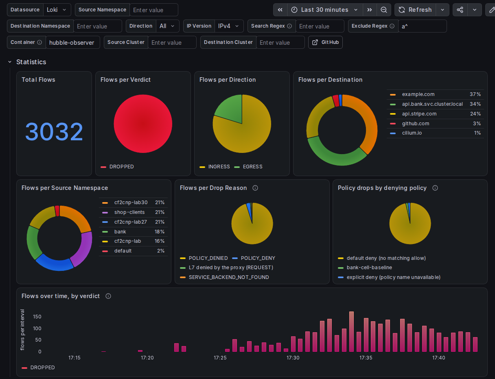

<div align="center">

</div>

# Hubble Observer

The Hubble Observer is a small observability component that monitors network flows within Cilium.
> **Note:** You can enable the **CF2CNP** feature in the Helm chart (`cf2cnp.enabled=true`) to automatically generate CiliumNetworkPolicies based on observed network flows. **These policies are not applied automatically; you need to download them and apply them yourself.** See the `values.yaml` file for additional `cf2cnp` configuration options.

The Hubble Observer also includes a Grafana dashboard for visualizing Cilium network flows. Here's a preview of the dashboard:

[](https://grafana.com/grafana/dashboards/23862)

## Prerequisites

Before installing the Hubble Observer, ensure you have the following components installed in your Kubernetes cluster:

1. **Hubble Relay**
   - Required to connect to all Cilium pods and export the flows.

1. **Grafana Operator**
   - Required for deploying the Grafana dashboard. (you can disable this: `grafanaDashboard.enabled=false`)
   - Installation instructions: [Grafana Operator Documentation](https://github.com/grafana/grafana-operator)

1. **Loki**
   - Required for log aggregation and querying
   - The Grafana dashboard uses LogQL queries
   - Installation instructions: [Loki Documentation](https://grafana.com/docs/loki/latest/setup/install/)

> The way it works is very straightforward: it uses the hubble container image which connects to the hubble relay and sends all flows to the stdout. Thats why you need a log collector which ships the logs to Loki.

## Installation

```bash
helm upgrade --install hubble-observer oci://ghcr.io/onzack/helm-charts/hubble-observer --version <VERSION>
```

## Configuration

See `values.yaml` for configuration options.

CF2CNP can be exposed via `cf2cnp.ingress` or, with the Gateway API, via `cf2cnp.httpRoute`. The URL the Grafana dashboard uses is taken from the first ingress host or httpRoute hostname.

## TLS and mTLS to Hubble Relay

If TLS is enabled on the Hubble Relay server (`hubble.relay.tls.server.enabled=true` in Cilium), the Hubble Observer has to connect over TLS as well. When the relay additionally enforces mutual TLS (`hubble.relay.tls.server.mtls=true`), a client certificate signed by the Cilium CA is required.

Cilium creates its Hubble certificates in the namespace it is installed into (usually `kube-system`). Helm can only mount secrets from the namespace of the release, so the certificates have to be available in the namespace the Hubble Observer is installed into.

### Configure the chart

TLS only (relay verifies nothing, the observer verifies the relay):

```yaml
hubbleRelay:
  tls:
    enabled: true
    ca:
      secretName: hubble-observer-relay-certs
```

mTLS, with the CA and the client key pair in the same secret:

```yaml
hubbleRelay:
  tls:
    enabled: true
    ca:
      secretName: hubble-observer-relay-certs
    client:
      enabled: true
      secretName: hubble-observer-relay-certs
```

The CA can also come from a ConfigMap, for example a cluster wide CA bundle, via `hubbleRelay.tls.ca.configMapName`. The key names inside the secret or ConfigMap are configurable through `hubbleRelay.tls.ca.key`, `hubbleRelay.tls.client.certKey` and `hubbleRelay.tls.client.keyKey`.

### Notes

- `hubbleRelay.port` is empty by default and resolves to `443` when `hubbleRelay.tls.enabled=true` and to `80` otherwise, matching Cilium's relay service. Set it explicitly if you changed `hubble.relay.servicePort`.
- `hubbleRelay.tls.serverName` defaults to `hubble.hubble-relay.cilium.io`, which matches the `*.hubble-relay.cilium.io` certificate Cilium issues for the relay. Adjust it if your relay certificate uses a different name, for example when `hubble.relay.tls.server.extraDnsNames` is set.
- The hubble CLI does not reload certificates while running, so the pod has to be restarted after certificate rotation.
- The certificates are mounted with mode `0400`. When running the container as a non-root user, set `podSecurityContext.fsGroup` so the files stay readable.
- `hubbleRelay.tls.insecureSkipVerify=true` disables verification of the relay certificate. It is only meant for debugging.
