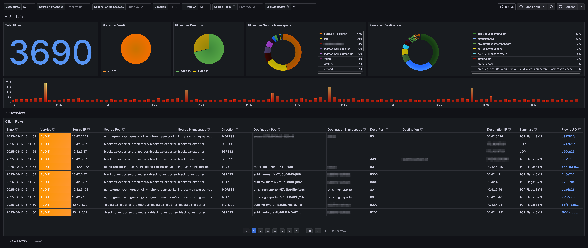

<div align="center">

</div>

# Hubble Observer

The Hubble Observer is a small observability component that monitors network flows within Cilium.

The Hubble Observer includes a Grafana dashboard for visualizing Cilium network flows. Here's a preview of the dashboard:

[](https://grafana.com/grafana/dashboards/23555)

## Prerequisites

Before installing the Hubble Observer, ensure you have the following components installed in your Kubernetes cluster:

1. **Hubble Relay**
   - Required to connect to all Cilium pods and export the flows.

1. **Grafana Operator**
   - Required for deploying the Grafana dashboard. (you can disable this: `grafanaDashboard.enabled=false`)
   - Installation instructions: [Grafana Operator Documentation](https://github.com/grafana/grafana-operator)

1. **Loki**
   - Required for log aggregation and querying
   - The Grafana dashboard uses LogQL queries
   - Installation instructions: [Loki Documentation](https://grafana.com/docs/loki/latest/setup/install/)

> The way it works is very straightforward: it uses the hubble container image which connects to the hubble relay and sends all flows to the stdout. Thats why you need a log collector which ships the logs to Loki.

## Installation

```bash
helm upgrade --install hubble-observer oci://ghcr.io/onzack/hubble-observer:<VERSION>
```

## Configuration

See `values.yaml` for configuration options. 